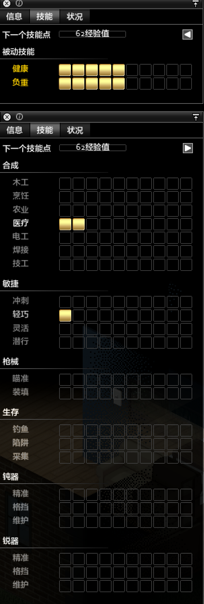

# 技能

**技能**指您的游戏人物所学习到的能力，技能等级显示出您在特定技能的熟练程度。

可以通过获得的技能点，分配到相应技能，来提高技能等级。

技能目前的分类为: 合成、敏捷、枪械、生存、钝器、锐器。

除此之外，还有2个被动技能: 健康和力量

## 目录

- [升级](#升级)
- [技能表](#技能表)
    - [敏捷](#敏捷)
    - [锐器](#锐器)
    - [钝器](#钝器)
    - [合成](#合成)
    - [枪械](#枪械)
    - [生存](#生存)
- [被动技能](#被动技能)

### 升级

当玩家磨炼游戏中的各种技能时，玩家将获得技能点，有用提高技能（如果有可提高的技能）。

玩家没获得一个技能点，获得下一个技能点就需要多花费100点经验值。

- 黄金方块
    表示已经获得技能
- 黑色方块
    表示尚未训练的技能
- 部分白色方块
    表示已部分训练但未达到100%，无法提高技能等级
    
子技能: **木工、烹饪、农业、医疗、电工、焊接、技工、钓鱼、陷阱、采集**， 有**相应的书籍**，阅读后可以**增加经验加成**。
书籍的等级对应相应的技能等级，所以**阅读大师级木工**，对于只有**0级木工**的角色**没有任何作用**，因为这对角色来说**太难理解了**。

根据游戏**初始选定的技能等级**，会**提高**相应**升级奖励**。这个奖励在游戏中**始终不变**，无论您是否将**更多的技能点**投入到这个**技能**中。

例如： 如果从**1级木工**开始，您的升级速度为**0.75倍**(0级为0.25倍)，即使您随后将其训练到**4级木工**，您仍将**只有0.75倍**的速度，而不是在**4级后**拥有**1.25倍**速度。

详细如下：

- **0级** +0.25倍速度
- **1级** +0.75倍速度
- **2级** +1倍速度
- **3级以上** +1.25倍速度

### 技能表

#### 敏捷

| 名称     | 影响 |
| -------- | ------- |
| 冲刺 | 增加您的奔跑速度，可以通过（按住**SHIFT**）进行奔跑并增加经验， |
|  | 如果角色身体不佳/肥胖/过度劳累/负担过重，他们只能普通走路，但这样做仍然可以获得冲刺XP |
| 轻巧 | 影响奔跑、潜行时发出的噪音，可以通过在僵尸未发现的情况下，在其附近游走行走或奔跑来增加经验 |
| 灵活 | 影响潜行、翻越围栏和瞄准时损失的视野，可以通过潜行或者翻越围栏来增加经验 |
| 潜行 | 潜行时不被僵尸发现的能力，可以通过在未被僵尸发现的情况下，在僵尸附近游走（按住**CTRL**或**Z**） |

#### 锐器

| 名称     | 影响 |
| -------- | ------- |
| 精准 | 影响武器的命中率、造成的伤害和暴击率，通过攻击僵尸来获得经验 |
| 格挡 | 当装备锐器时，帮助玩家避免受伤，通过攻击僵尸来获得经验 |
| 维护 | 使用锐器时有几率不掉耐久，通过使用锐器来获得经验，一旦武器损坏，则不会获得经验， |
|  | 所以想训练这个技能，需要一个不易损坏的锐器（可以使用贴吧大佬的方法，装备锐器推门练经验） |

#### 钝器

| 名称     | 影响 |
| -------- | ------- |
| 精准 | 影响武器的命中率、造成的伤害和暴击率，通过攻击僵尸来获得经验 |
| 格挡 | 当装备钝器时，帮助玩家避免受伤，通过攻击僵尸来获得经验 |
| 维护 | 使用钝器时有几率不掉耐久，通过使用钝器来获得经验，一旦武器损坏，则不会获得经验， |
|  | 所以想训练这个技能，需要一个不易损坏的钝器（可以使用贴吧大佬的方法，装备钝器推门练经验） |

#### 合成

| 名称     | 影响 |
| -------- | ------- |
| 木工 | 提高木工技能，可以使您的修复物品、建筑、改善品质时，提高物品的生命值 |
|  | 通过设置路障、使用模板制作东西、拆除家具、将原木据称木板，来增加经验 |
| 烹饪 | 提高烹饪技能，可以使您减少合成食品的饥饿感。此外，将此技能提升到4级，可以使您使用腐烂的食材做汤和炖菜 |
|  | 通过在热源中烹饪食物或通过配方来制作食物，来增加经验 |
| 农业 | 提高农业技能，可以使您可以检查植物，并随着该技能的增加，有用信息也会增加，通过收获农作物来，来增加经验 |
| 医疗 | 提高医疗技能，可以使您更快的治疗上课，制作更好的绷带，了解更多的疾病，并且可以在您的健康面板中显示感染信息 |
|  | 技能越高，康复越快，通过对自己或他人进行医疗救治，来增加经验 |
| 电工 | 提高电工技能，可以使您可以操作发动机并制作设备，通过拆卸电子设备（收音机、CD播放器等），来增加经验 |
| 金工 | 提高金工技能，可以使您建造比木板成坚固的建筑，通过建造金属制品、建筑物。路障，来增加经验 |
| 技工 | 提高技工技能，可以使您可以修理汽车或更换汽车零件，与电工结合使用，可以帮助您无钥匙就可以开车，通过拆卸汽车零件，增加经验 |

#### 枪械

| 名称     | 影响 |
| -------- | ------- |
| 瞄准 | 瞄准技能决定射击的精准度、暴击率、射程、角度、后坐力恢复时间，通过使用枪支射杀僵尸，来增加经验 |
| 装填 | 装填技能决定需要多长时间才能取出一个弹匣，装上子弹，再把弹匣插回原处。通过装填任意枪支，来获得经验 |
|  | 注意: 当装填弹药设置为普通/硬核时，可以反复装填一把手枪用以练习，不必卸下武器 |

#### 生存

| 名称     | 影响 |
| -------- | ------- |
| 钓鱼 | 钓鱼技能决定钓鱼所需时间、脱钩、失去鱼饵或渔具的几率，并增加掉到大鱼的机率。通过将鱼线放入水中，来获得经验 |
|  | 无论钓鱼结果如何，您都会获得经验，大鱼会带来更多经验 |
| 陷阱 | 陷阱技能决定有多大几率在陷阱中捕获某些东西，并有能力制作新的陷阱，通过取回陷阱中的动物，来获取经验 |
| 采集 | 钓鱼技能可以让您有更好的机会找到质量更高、数量更多的食物。通过金融森林，并右键某个区域选择**搜寻**， 来获取经验  |

### 被动技能

| 名称     | 影响 |
| -------- | ------- |
| 健康 | 您的健康等级决定了您有多少耐力，让您走的更远而不疲劳，还可以提高奔跑速度 |
|  | 通过短跑(目前为每次短跑获得1点健康XP)，并可以在不过度劳累角色的前提下，进行近战攻击，来获得经验 |
| 负重(力量) | 负重技能决定负重多少，以及一些其他事情（例如：可以打开锁着的窗户和近战击退僵尸） |
|  | 通过重物奔跑来获得经验，当近战攻击僵尸或树木时，也可以获得经验 |

| 负重(力量)     | 0 | 1 | 2 | 3 | 4 | 5 | 6 | 7 | 8 | 9 | 10 |
| -------- | ------- | ------- | ------- | ------- | ------- | ------- | ------- | ------- | ------- |
| 搬运重量 | 6 | 7 | 8 | 9 | 11 | 12 | 14 | 15 | 16 | 18 | 20 |

注意： **升级健康和负重**后，您的角色将**获得或失去**一些特性。

    例如：拥有 软弱 特性的角色，练习 负重 后会失去它。
    例2：不拥有修改 负重 特性的角色，练习 负重 后会获得 壮硕
    
注意2：目前，只需反复**徒手攻击树木**，就可以同时获得**健康和负重的经验**。

只要玩家没有发现**僵尸的踪影**，就可以一次练习几小时**快速练习**，并在几小时内获得**2个被动技能的数千点经验**。

## 也可以看看

- [特性](01-02-traits.md)
- [合成](01-04-moodles.md)
