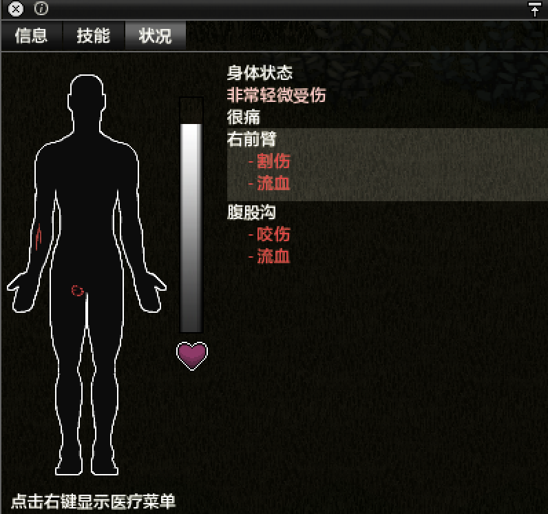

# 健康状况

角色的健康状况显示在健康状况窗口中，可通过单击屏幕左上角的心脏图标来访问。

受伤后，屏幕的右上方会出现相应的情绪状态，可能会听到受伤的声音，并且相应的韧带也会受伤。

角色的身体分为17个不同的部分:

- 左右脚
- 左右小腿
- 左右大腿
- 左右手
- 左右前臂
- 左右上臂
- 腹股沟
- 上身
- 下身
- 颈
- 头

## 身体状态

| 状态     | 描述 |
| -------- | ------- |
| 良好 | 没有受伤 |
| 微微受伤 | 90％至完全健康。 |
| 非常轻微受伤 | 80％至90％的健康状况。 |
| 中度受伤 | 60％至80％的健康状况。 |
| 严重受伤 | 50％至60％的健康 |
| 很严重受伤 | 生命值介于40％和50％之间 |
| 非常严重受伤 | 生命值介于20％和40％之间 |
| 与死亡只差一步 | 生命值介于10％和20％之间 |
| 死亡即将来临 | 生命值介于0%到10％之间的 |
| 已死亡 | 生命值为0 |
| 僵尸化！ | 您被感染并逐渐失去生命，将会死亡。 |

## 治疗

默认情况下，玩家的大多数伤害都可以恢复，要用没有进一步受到伤害或有其他条件阻止恢复（例如：未包扎伤口或感染）

恢复的速度受影响于[情绪状态](01-04-moodles.md)，饱食将加快恢复速度，而饥饿或感冒会减慢恢复速度。

### 包扎

任何破坏皮肤的伤口都会引起出血，需要用**医用绷带**或**撕开的床单**包扎。用**干净绷带**包扎伤口可以**降低感染的几率**。对

伤口进行消毒，然后使用**消毒的绷带**或**消毒的碎布**包扎会进一步降低了**感染的几率**。

但是随着时间的流逝，绷带会**变脏**，这不仅会**抵消**以前的抗感染能力，而且如果留在伤口上，实际上会**增加感染的几率**。

这时需要角色**移除绷带**并换上**干净的绷带**。伤口的**类型**和**严重程度**将决定清洁绷带**变脏的速度**。

### 伤害类型

| 状态     | 病症 | 原因 | 治疗 |
| -------- | ------- | ------- | ------- |
| 咬伤 | 中等程度的生命值损失，[出血](01-04-moodles.md#出血)和[疼痛](01-04-moodles.md#疼痛) | 被僵尸攻击时有发生的几率。 | 绷带可以阻止流失生命值，但是玩家被感染并最终死于尸化的可能性很高。 |
| 流血 | 生命值损失，[出血](01-04-moodles.md#出血)和[疼痛](01-04-moodles.md#疼痛) | 划伤、被咬伤、深伤、散落的子弹和散落的玻璃碎片。 | 用绷带包扎患处。如果不加以治疗，玩家将继续流血并失去生命值，直到流干鲜血为止。 |
| 烧伤 | 严重的生命值损失，[出血](01-04-moodles.md#出血)和[疼痛](01-04-moodles.md#疼痛) | 站得离火太近 | 用干净的绷带包扎，定期更换并保持干净。恢复时间很长。 |
| 重伤 | 生命值损失，[出血](01-04-moodles.md#出血)和[疼痛](01-04-moodles.md#疼痛) | 徒手砸碎玻璃、爬过破碎玻璃的窗户、跌下楼层、开车与地形/其他车辆相撞、被斧头砍到等 | 用缝合针或线与针缝合（缝合针引起的疼痛较小）。 |
| 骨折 | 生命值损失，速度下降（如果腿部受伤）、战斗力下降（如果胳膊部受伤）、[疼痛](01-04-moodles.md#疼痛) | 从高于地面的任何地板上掉落（如果您背着重物会更严重）、 | 用绷带（或脏碎布）和笔直的木质物品（树枝，结实木棒或木板）制作夹板 |
|  |  | 以**高速**行驶时与地形/其他车辆相撞（需要测试各种速度）、以及钝器的冲击。 |  |
| 中弹 | 严重的生命值损失，[出血](01-04-moodles.md#出血)和[疼痛](01-04-moodles.md#疼痛) | 被抢击中 | 	子弹必须使用镊子取出，用消毒液或酒精消毒，使用缝合针或针缝合，然后包扎。 |
| 刺伤 | 生命值损失，[出血](01-04-moodles.md#出血)和[疼痛](01-04-moodles.md#疼痛) | 徒手砸碎玻璃、从破碎的窗户爬过 | 用镊子去除碎片，然后用绷带包扎。包扎仍带玻璃的伤口会引起额外的疼痛。 |
| 割伤 | 轻微的生命值损失，[出血](01-04-moodles.md#出血)和[疼痛](01-04-moodles.md#疼痛) | 被僵尸抓伤、砸窗户、开车与地形/其他车辆发生碰撞、爬铁丝网 | 用绷带止血，如果割伤是有僵尸造成的，会有25%的几率尸化。 |
| 伤口感染 | 生命值损失，[疼痛](01-04-moodles.md#疼痛) | 以前遭受的任何伤口都有几率被感染，无论是开放性伤口还是包扎伤口。 | 没有受伤 |
|  |  | 如果先消毒伤口然后再用消毒绷带包扎，则感染的可能性较小。 | 用酒精消毒伤口并用消毒绷带包扎 |

### 其他伤害

| 状态     | 描述 |
| -------- | ------- |
| [重负荷](01-04-moodles.md#重负荷) | 当**负担极重**时，走路会导致严重的生命值损失，并可能造成严重的伤害。 |
| 跌倒损伤 | 从高处掉落造成的。损害程度取决于高度。例如，从二层窗户跳下会造成严重损害，而从较高楼层跳下会导致死亡。 |
| 疾病 | 由于感染尸毒或吃了变质食物，疾病最初会减缓愈合。如果病情恶化，角色将开始损失掉所有健康的身体部位，并慢慢死亡。 |
